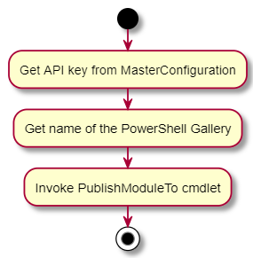
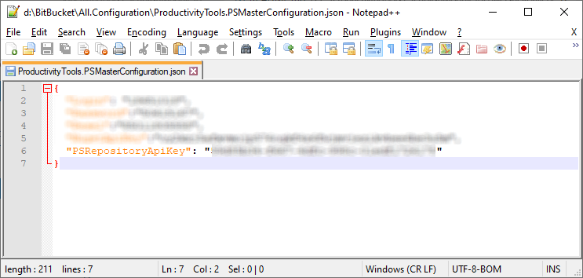
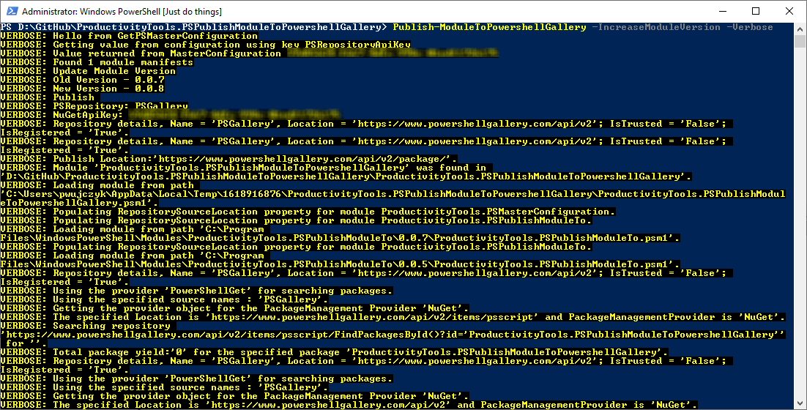

<!--Category:Powershell--> 
 <p align="right">
    <a href="https://www.powershellgallery.com/packages/ProductivityTools.PSPublishModuleToPowershellGallery/"></a>
    <a href="http://productivitytools.tech/publish-moduletopowershellgallery/"><a> 
    <a href="https://github.com/pwujczyk/ProductivityTools.PSPublishModuleToPowershellGallery"></a>
</p>
<p align="center">
    <a href="http://productivitytools.tech/">
        
    </a>
</p>

# Publish module to PowerShell Gallery

Module finds psd1 file in current directory (recursive) and pushes it to www.powershellgallery.com portal.




Module is dependent on [Publish-ModuleTo](http://productivitytools.tech/publish-moduleto/). It uses [MasterConfiguration](http://productivitytools.tech/powershell-master-configuration/). To use it add **PSRepositoryApiKey** key to MasterConfiguration. 




To use module invoke command in the directory of module.

```powershell
Publish-ModuleToPowershellGallery
```



